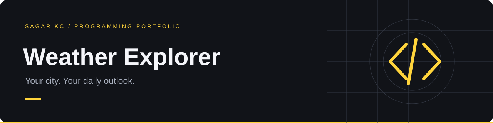

# Weather Explorer

A responsive weather app that turns a city search into current conditions and a five-day outlook.

**HTML · CSS · JavaScript · Open-Meteo API**

## Features

- City search with a choice of matching locations
- Temperature, feels-like temperature, humidity, and wind
- Five-day high/low forecast and weather descriptions
- Loading, no-results, and network-error feedback
- Cancellation of outdated requests with `AbortController`
- Responsive layout and accessible status announcements

## Run

```sh
python -m http.server 8000
```

Open http://localhost:8000. On Windows, use `py -m http.server 8000` if needed. Internet access is required for weather data.

## How it works

1. Search the Open-Meteo geocoding API.
2. Select the intended city from matching results.
3. Fetch current conditions and five daily forecasts using its coordinates.
4. Render text safely with `textContent`.

## Project files

| File | Responsibility |
| --- | --- |
| `index.html` | Search form and page structure |
| `app.js` | Requests, state, weather descriptions, rendering |
| `style.css` | Layout and visual styling |

## Data attribution

Weather model data provided by [Open-Meteo](https://open-meteo.com/). See the [forecast documentation](https://open-meteo.com/en/docs) and [geocoding documentation](https://open-meteo.com/en/docs/geocoding-api). The non-commercial endpoint requires no API key. Review the provider's terms before commercial use.

## Limitations and next steps

Current conditions are weather-model estimates. The app uses Celsius and km/h. Future improvements: saved favourite cities, unit switching, and an hourly forecast chart.
